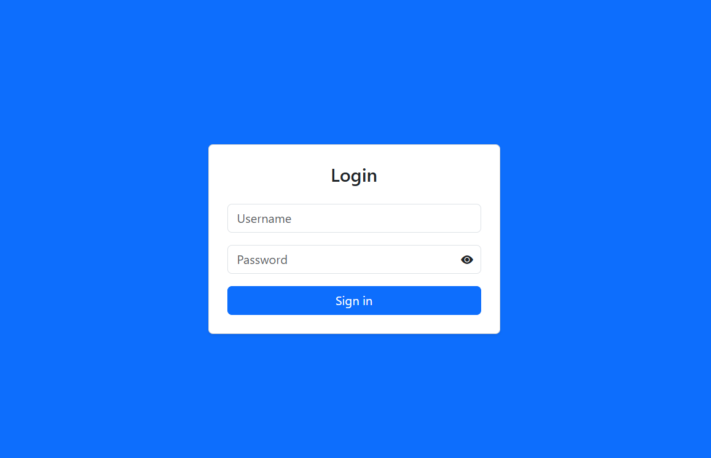
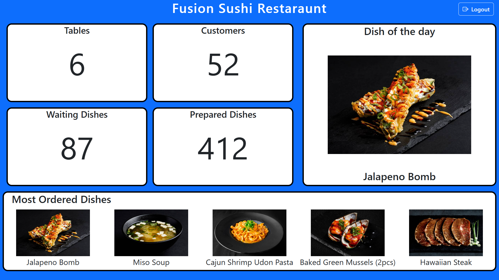

> ## Interfaccia Login

> ### Login

All'avvio dell'applicazione viene presentata automaticamente la schermata del login. Che permette l'accesso all'applicazione solo dopo l'autenticazione

---
# Introduzione all'applicazione Cucina
> ## Interfaccia Home

> ### Header

nell' header è presente l'orario corrente, aggiornato in tempo reale e il pulsante di logout.

> ### Ordini

nella parte a sinistra sono elencati gli ordini, in ogni ordine sono elencati i prodotti ordinati e le rispettive quantità.
**Gli ordini effettuati dallo stesso tavolo nello stesso minuto vengono raggruppati.**
In basso è presente il pulsante "Sign as completed" che contrassegna come completato l'ordine (o gli ordini in caso siano stati raggruppati).
Gli ordini che attendono da almeno 10 minuti avranno l'header giallo al posto che azzurro. Se attendono da almeno 15 minuti da giallo l'header diventerà rosso. 

> ### Sezioni
In alto a destra è presente un menu a tendina che contiene le sezioni della cucina, in questo caso:
- Cucina
- Dolci
- Bevande

Nel caso all'interno dell'API venissero aggiunte nuove sezioni, il menu a tendina aggiornerebbe autonomamente i suoi contenuti.

> ### Elenco sommativo

per comodità sulla destra, sotto al menu a tendina abbiamo posizionato un elenco di tutto il cibo ordinato e le rispettive quantità in ordine alfabetico in modo da dare una visione più generale dei cibi da preparare.

---
# Introduzione all'applicazione Statistiche

> ## Interfaccia Stats

> ### Sezioni
la pagina è divisa in 6 sezioni, ciascuna delle quali mostra un certo dato in tempo reale, le seguenti sono:
- **Tables**, indica il numero di tavoli aperti
- **Customers**, mostra il numero di clienti presenti nel locale
- **Waiting Dishes**, indica il numero di piatti da preparare
- **Prepared Dishes**, indica il numero di piatti già consegnati
- **Dish of the day**, mostra il piatto più ordinato
- **Most Ordered Dishes**, mostrano i primi 5 piatti più ordinati