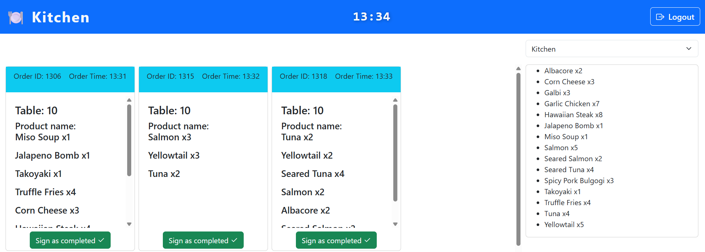

# Introduzione all'applicazione
> ## Interfaccia Login

> ### Login

All'avvio dell'applicazione viene presentata automaticamente la schermata del login. Che permette l'accesso all'applicazione solo dopo l'autenticazione

---
> ## Interfaccia Home

> ### Header

nell' header è presente l'orario corrente, aggiornato in tempo reale e il pulsante di logout.

> ### Ordini

nella parte a sinistra sono elencati gli ordini, in ogni ordine sono elencati i prodotti ordinati e le rispettive quantità.
**Gli ordini effettuati dallo stesso tavolo nello stesso minuto vengono raggruppati.**
In basso è presente il pulsante "Sign as completed" che contrassegna come completato l'ordine (o gli ordini in caso siano stati raggruppati).

> ### Sezioni
In alto a destra è presente un menu a tendina che contiene le sezioni della cucina, in questo caso:
- Cucina
- Dolci
- Bevande

Nel caso all'interno dell'API venissero aggiunte nuove sezioni, il menu a tendina aggiornerebbe autonomamente i suoi contenuti.

> ### Elenco sommativo

per comodità sulla destra, sotto al menu a tendina abbiamo posizionato un elenco di tutto il cibo ordinato e le rispettive quantità in ordine alfabetico in modo da dare una visione più generale dei cibi da preparare.